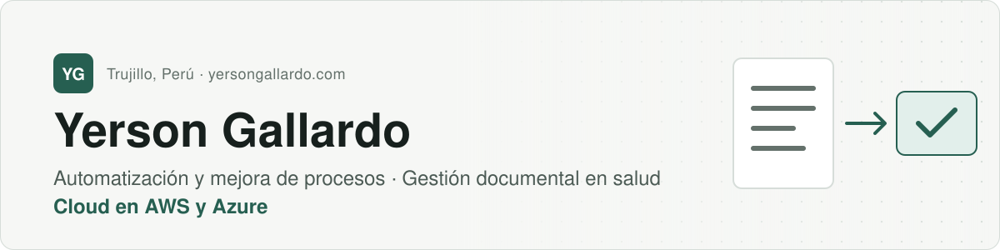

<picture>
  <source media="(prefers-color-scheme: dark)" srcset="assets/banner-dark.svg">
  
</picture>

 

Trabajo en la Unidad de Registros Médicos de un hospital de alta complejidad de EsSalud, donde gran parte del trabajo documental todavía se hace a mano. Antes operé infraestructura en AWS, Azure y servidores on-premises durante más de dos años en NTT DATA, y antes de eso hice desarrollo backend con .NET.

> **Entender el proceso desde dentro cambia qué automatización tiene sentido proponer.**

## Proyecto destacado

### [Conoce a tu Enfermera(o)](https://github.com/ygallardops/conoce-tu-enfermero-demo)

Prototipo de consulta pública de colegiatura que responde sin pedir identificación y sin guardar quién consultó, sobre un plan gratuito y sin infraestructura permanente. El reto: que la consulta sea útil para una persona e inútil para quien quiera copiar el padrón completo.

- **Sin datos del consultante:** no hay registro, login ni DNI. Lo que no se recolecta no se puede filtrar.
- **Proyección pública aislada:** la web solo lee una copia mínima del padrón; nunca llega al sistema de origen.
- **Controles anti-extracción sin servidores:** coincidencia exacta, máximo cinco resultados, Turnstile y límite de consultas por IP en el borde de Cloudflare.
- **Cadena de verificación bloqueante:** CodeQL, Dependency Review y Dependabot en cada cambio, y OWASP ZAP cada semana.

Datos sintéticos. Proyecto personal, sin relación con el Colegio de Enfermeros del Perú.

## Apuntes y laboratorios

No son entregables profesionales: son notas de estudio y prácticas que mantengo en público.

| Repositorio | Qué contiene |
| --- | --- |
| [**devops-notes**](https://github.com/ygallardops/devops-notes) | Apuntes de troubleshooting en Azure reunidos durante mi trabajo en soporte. Por ahora, diagnóstico de pods en AKS. [Leer en línea](https://ygallardops.github.io/devops-notes/) |
| [**ansible-playbooks**](https://github.com/ygallardops/ansible-playbooks) | Playbooks de práctica para configurar servidores Linux, instalar Docker y aplicar hardening básico. |
| [**ops-automation**](https://github.com/ygallardops/ops-automation) | Ejercicios de automatización operativa en Python y Bash, con pruebas y CI. |

## Trayectoria

- **Hoy:** Digitador Asistencial en la Unidad de Registros Médicos de EsSalud.
- **NTT DATA, más de dos años:** operación de infraestructura en AWS, Azure y on-premises. Pasé del soporte de primer nivel al de segundo nivel.
- **Antes:** soporte de aplicaciones y desarrollo backend con .NET y SQL Server para empresas del Grupo Romero.
- **Formación:** bachiller en Ingeniería de Sistemas Computacionales (UPN) y profesional técnico en Computación e Informática (Cibertec).

## Herramientas

**Cloud** &nbsp;

**Desarrollo** &nbsp;

**Automatización** &nbsp;

**Salud** &nbsp;

<b>Ver el detalle de servicios y funciones</b>

 

**Cloud y operación:** soporte de primer y segundo nivel en AWS (EC2, S3, RDS, Lambda, DynamoDB, Route 53, Elastic Beanstalk, CloudFormation) y Azure (App Service, Azure SQL, Storage, AKS, API Management, Entra ID). Monitoreo con CloudWatch, Azure Monitor y New Relic.

**Desarrollo:** servicios backend con .NET Core y SQL Server, y APIs sobre API Gateway, Cognito y Lambda. Python, Bash y PowerShell para tareas operativas.

**Gestión de información:** historias clínicas y documentación asistencial, registro y consolidación en HIS MINSA y SISCAP, y elaboración de reportes.

## Certificaciones

-17201d?style=flat-square&labelColor=265f51)
-17201d?style=flat-square&labelColor=265f51)
